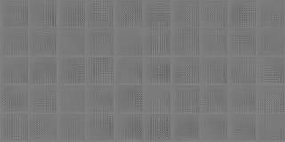
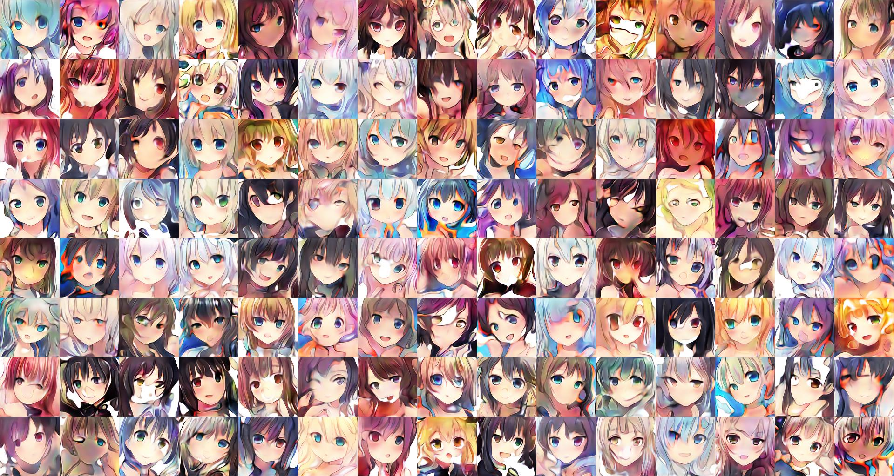
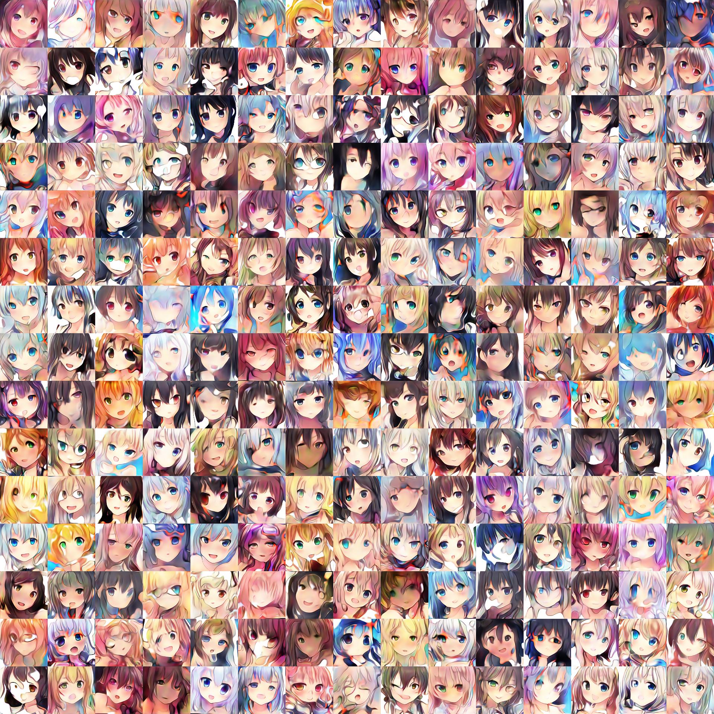
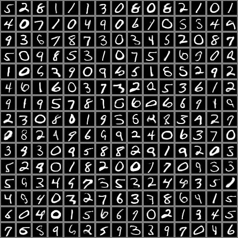

# WGAN-GP Anime with Auxiliary Classifier

WGAN-GP with Auxiliary Classifier:

Anime face interpolation in latent space:

[weights](https://github.com/peter0749/WGAN-GP-Anime-with-Auxiliary-Classifier/releases/download/0.3.0/acwgan_anime_128x128.zip)

Back to latent space:

mnist:

fashion-mnist:

WGAN-GP:

[weights_128x128](https://github.com/peter0749/WGAN-GP-Anime/releases/download/0.2.0/anime_128x128.7z)

[weights_96x96](https://github.com/peter0749/WGAN-GP-Anime/releases/download/0.2.0/anime_96x96.7z)

Training:

It can even generate MIDI loops!!

[weights_v1](https://github.com/peter0749/WGAN-GP-Anime/releases/download/0.2.0/midi_loop_generator.7z)

[weights_v2](https://github.com/peter0749/WGAN-GP-Anime/releases/download/0.2.0/midi_loop_generator_ver2.h5.zip)

[conditional](https://github.com/peter0749/WGAN-GP-Anime/releases/download/0.2.0/conditional_midi_loop.zip)

Generate mnist handwritten digits:

